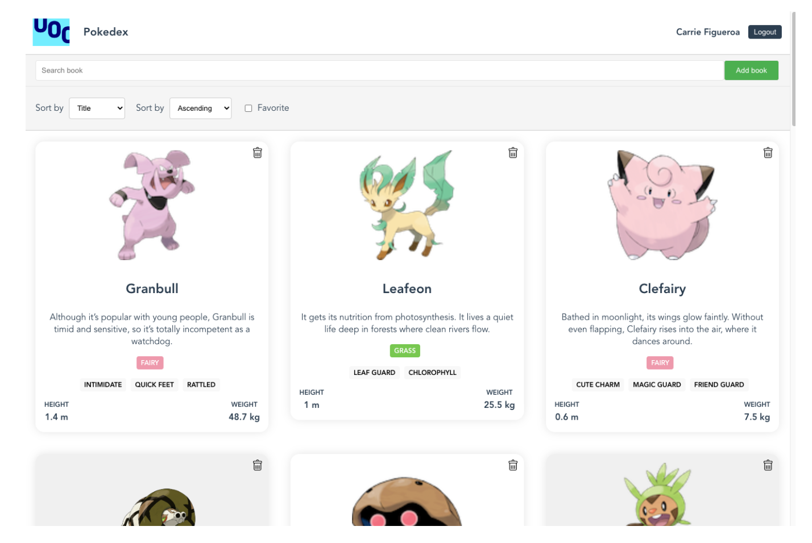
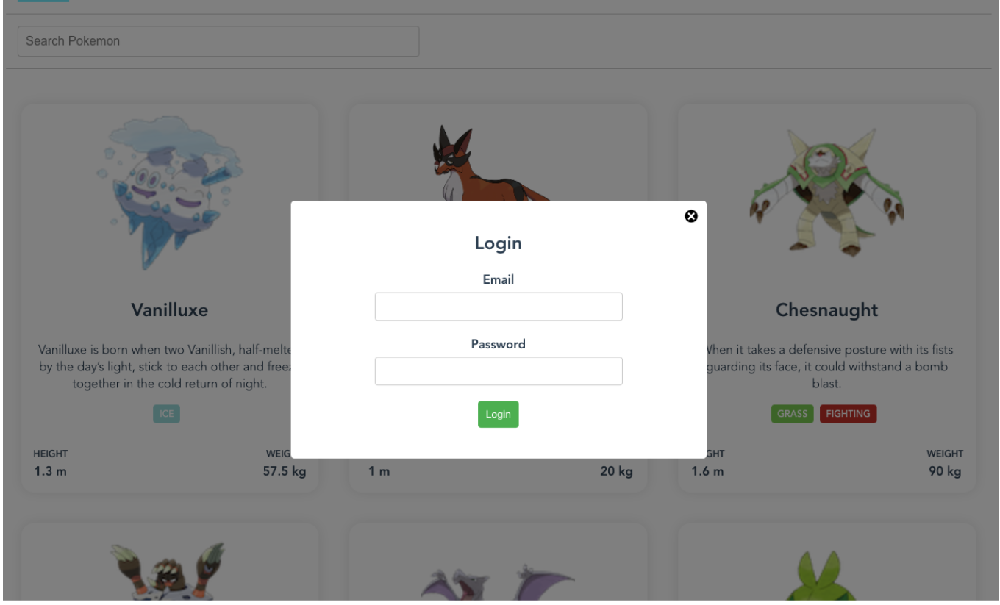
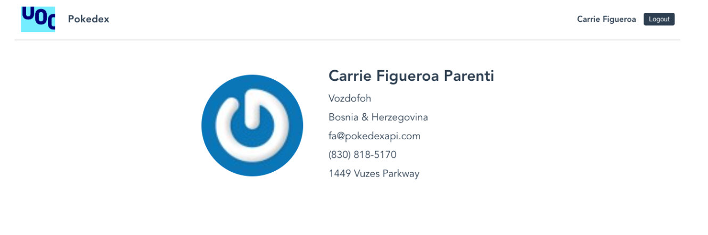
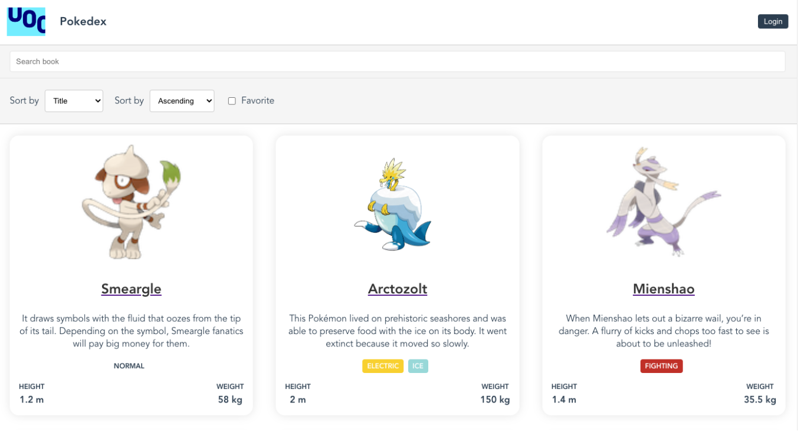
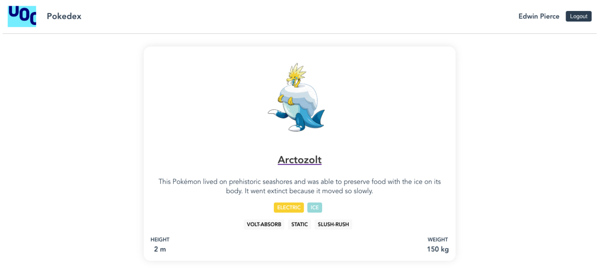

# Advanced Web Programming

## PRA: Time to put everything into practice

### Presentation

Until now, we have been working on the concepts of the subject with concrete examples in specific contexts in order to favor the assimilation of the concepts. The time has come to put everything you have learned into practice. In this PRA we propose the development of a web application using Vue as a framework. We will provide you with an API that you will have to use for the development of a web app that consumes its data for visualization.

### Competencies

This PRA develops the following competences of the Bachelor's Degree in Techniques for Software Development:

- **CB5.** Develop learning skills necessary to undertake further studies with a high degree of autonomy.
- **CT3.** Adapt to new software development technologies and to future environments, updating professional skills.
- **CE6.** Design and build computer applications using development, integration and reuse techniques.

### Objectives

The specific objectives of this PRA are:

- Being able to implement a complete web application in Vue.
- Be able to present briefly and orally the work done.

### Reading Resources and Learning Guide

Below we indicate the reading resources that we consider important that you review and study to develop this PRA. As we have been doing in the CATs, we also indicate the sections (or specific chapters) that you should read carefully for the correct execution of this PRA. As always, if you want to go deeper, you can review and read the non-recommended sections in this list of each resource.

- 💻**Vue docs**
  
  - **Essentials.** [https://vuejs.org/guide/essentials/application.html](https://vuejs.org/guide/essentials/application.html)
  In this series of chapters, a brief review is made of the basic characteristics of Vue, its structure and the basic principles for using this framework. Pay special attention to the Template Syntax, Reactivity Fundamentals, and Component Basics chapters, as this is where most of the concepts needed to complete this PRA are developed.

- 💻**Pinia Docs. Official Dev Docs**
  
  - Pay special attention to the sections of the State, Getters and Actions chapter, since it is the place where you can find the relative information to develop with Pinia.
  
- 📕**Book: John Au-Yeung. Vue.js 3 By Example. O'Reilly, 2021**

In this PRA you will also have to deliver a video presentation of your work, so we indicate the following resources so that you can prepare for this part.

- 💡In this PRA you must prepare a video that addresses some questions about the work you have done. This task will allow us to better evaluate your work but, above all, it will allow you to practice the oral presentation of your work, which is an essential task that will help you in the future when you have to work in development teams.
  
- 📹 **¿Cómo hacer presentaciones visuales de proyectos de diseño? (ES)**
  - Video seminar on how to make quality presentations. We found it very useful for you to learn important techniques for oral presentations.
- 💡 **Consejos para la autograbación y las videoconferencias (ES / CAT)**
  - Instructions, as a brochure, about what to do and what not to do in your video presentations.
- 📹 **Installation and configuration of the OBS Studio program for recording (EN)**
  - We have prepared this guide as a tutorial to help you to prepare the video you must deliver as part of this PRA. You can download it from the classroom.

### Submission format

Through the campus you must deliver:

1. **A zip file with the contents of the project's src folder**
2. A video showing the application in operation. In the section “Presentation of the application” we give you instructions for the video, which must follow the following format:
   - a. The video must show the content that is being presented (slides, code, developed web, etc.) and, in addition, include in the lower right corner the video captured from the webcam that shows you, the student, presenting.
   - b. The duration of the video will be 5 minutes maximum.
   - c. The video must have a minimum resolution of 720p.
   - d.  If the video cannot be uploaded to the Registry due to technical or space problems, it is recommended to upload it to a cloud storage system or Youtube (configuring the video as private) and sending the link to the teaching staff.

### Score

- The development of the application scores a maximum of 8 points. The correction will take into account:
  - Correct creation of components and correct file structure (10%)
  - Correct creation of parameters/data (10%)
  - Successful creation of API calls (20%)
  - Correct management of Login and user information (20%)
  - HTML structure of components based on styles or own CSS (10%)
  - Store development with Pinia (10%)
  - Routing management and page creation (10%)
  - Overall code quality (10%)
- The video presenting the work scores a **maximum of 2 points**. The correction will take into account:
  - Quality and layout of the presentation (20%)
  - Correct visualization of the student throughout the video (20%)
  - Clarity and efficiency in the presentation of content (60%)

### Contact

If you have to ask something through the forum or by email, copy your code to an online platform and send the link to avoid problems with the UOC mail (since it eliminates the .js files to avoid injecting malicious code). We recommend using either of these two options:

- **Codepen** (for simple code snippets)
- **CodeSandBox** (for more complex examples)

**Note:** In case of publishing some code in the forum, they must be generic queries and not direct solutions to the exercises. Making exercise solutions accessible to other classmates, although it may not have a direct intention, will be considered cheating and will be penalized academically at the course level.

### Intellectual property and plagiarism

The UOC Academic Regulations establish that the evaluation process is based on the student's personal work and presupposes the authenticity of the authorship and the originality of the done exercises.
The lack of originality in the authorship or the misuse of the conditions in which the evaluation of the subject is carried out, is an infraction that can have serious academic consequences.
The student will be graded with a fail (D/0) if a lack of originality is detected in the authorship of any continuous evaluation test (CAT) or final test, either because they have used unauthorized material or devices, or because they have copied verbatim from the internet, or has copied notes, from CAT, from materials, manuals or articles (without the corresponding citation) or from another student, or for any other irregular conduct.

### Introduction

The objective of this PRA is to put into practice the knowledge acquired during the subject in a project of similar complexity.

In this PRA you will build a Web application in Vue 3 to manage a Pokedex, that is, a list or agenda of Pokemons. This Pokedex has the particularity that will include Pokémon that can only be viewed if the user is logged in the app through API (i.e., are captured), so it will be necessary to create a system that allows you to log in correctly.

- 💡*In this PRA you can make use of the Options API or the Composition API. However, once the decision is made it is important to be consistent throughout the application*

The following image shows an example interface for the application:



This project will have the following main functionalities:

- Login form.
- Profile detail page, in which the detailed information of the logged in user will be displayed (if it is, if not, it should redirect to Home)
- Home page with a list of Pokémon, with the following features:
  - Registered users will see both captured and uncaptured, also abilities.
  - Possibility to delete Pokémon (registered users only).
  - Search bar to filter Pokemon.
  - Sorting filter and filtering by favorites or captured
- Pokemon detail page, the detailed information of the selected pokemon will be displayed if you are logged in. If it is not (or the pokemon does not exist) it must redirect to Home)
- Form to add Pokémon (registered users only).

The following materials will be provided to develop the project.

- `Pokedex API code`, to make calls to the login service and queries to the agenda.
- `Styles file styles.css`, for creating the HTML structure of the components. The styles should be assigned to each component individually, not by importing the css file. Style modifications can be made as long as the visual structure is similar to the one presented in the statement.

Below we detail each of the functionalities.

#### Login Form



This page should have a popup/modal to log in to the app. To log in correctly, you must use the login data that the API will randomly generate each time it is run.

If the login has been successful, the API will return (among other things) a token that will be necessary to make subsequent requests (such as showing captured Pokémon or generating new Pokémon), so it will be necessary to save the information throughout the entire session. To implement this functionality, Pinia can be used.

If the user has successfully logged in, instead of showing the Login button in the header, it should show the user's name and a Logout button, which will delete the stored information and reload the Pokémon list without capturing Pokémon.

#### Profile Page



In this PRA we will make use of Router View to create a detail page that shows the extra information about the logged in user. The URL from which this Vue view will be accessible will be `/profile`. This URL will be accessible from the link that will be created in the header with the username once it has been logged in. If you try to access this URL without being logged in, the view should redirect to the home view (`/`).

### Pokémon list, search form and filters



The main page will show a list of Pokémon with relevant information such as name, description, types, etc. In turn, it will have a button to delete this Pokemon. The deletion of the Pokemon will only be possible if the user is logged in.

Pokemon can be filtered through a search bar. This search engine should be able to search by **name, description, type or skills**. For example, if the user enters "Electric" the search engine will show all the Pokémon that include that term in their name, description, type or abilities.

In turn, there will be a **filters bar** that allows sorting the list of Pokemon by name, type, abilities, and a selector to show only the captured ones (if logged in).

### Pokemon detail page



Using Vue Router too (see appendix), it will be necessary to create a view of each Pokemon with all the information accessible from the API of each Pokemon. If the pokemon does not exist or is not logged in, it should display an alert message and redirect to Home.

### Pokémon form

As done in the CATs, it is necessary to create a form to add Pokémon to our Pokedex, the fields to consider, as a minimum, are the following:

```bash
- id: required
- name: required
- description
- species: required
- types: required
- abilities
- height
- weight
- sprite
- captured
```

### API Installation

In a similar way to what we did in the CAT 4, in this PRA we will use a local API that will be in charge of managing the Pokémon list and their persistence while it is running. This API will be accessible through a URL and a port, and allows you to operate with it using its methods. This technique is known as exposing the methods.

We have created the API documentation using Postman. In the [documentation website](https://documenter.getpostman.com/view/2392522/2s8Z6saafA#aa1871c3-1689-4d3c-ad36-fac8662a22c5) you can find the methods exposed (or endpoints) by the API, the types of requests enabled and the parameters necessary for its correct operation.

In order to access the API it is necessary to copy the contents of the `api.zip` file into the root of the project. Once copied it is necessary to install the necessary packages.

```bash
cd api
npm install
```

Once the necessary packages have been installed, the API can be executed using the command:

```bash
npm run api
```

The terminal will display a message like the following:

```bash
❯ npm run api

> pokedex-api@1.0.0 api
> node src/index.js

Server started. Port 3000
Login user created
email: muredip@pokedexapi.com
password: IHMZ)#XV40
```

Once the development starts, the terminal will offer information about possible errors when working with the API. Some examples of errors displayed in the terminal are as follows:

```bash
- Required id and name fields
- Pokemon already created
```

### Extra activity. State management with Pinia

Pinia is a library and pattern for handling state in Vue.js applications, it is the solution agreed as standard for the use of Stores in Vue 3 instead of Vuex. It allows you to centralize all the states of the components in objects called Store, which facilitates the management of states and events in complex applications, since it avoids having to propagate the changes of state between components as if it were a cascade.

To install Pinia in our project it is necessary to install the package via NPM:

```bash
npm install pinia
```

Once installed, it is necessary to instantiate Pinia within the Vue.js application. For this, the `src/main.js` file must be modified.

The content of this file is as follows:

```javascript
import { createApp } from 'vue'
import { createPinia } from 'pinia'
import App from './App.vue'
const pinia = createPinia()
createApp(App).use(pinia).mount('#app')
```

To finish, we are going to create a store in the `store/user.js` route. This will be the store that we will use to save the information related to the user so that it can be used throughout the entire application.

The form of the Pinia user store should be similar to the following:

```javascript
import { defineStore } from 'pinia'
export const useStore = defineStore('user', {
  state: () => {
    return {
      logged: false,
      name: '',
      email: '',
      token: '',
    }
  },
})
```

With this we are ready to work with Pinia.

#### Store definition

The store (in addition to the previously defined state) must have:

- `setUserData`: action that receives the API login data as a payload. This function should replace the state data with the payload data.
- `isLogged`: Getter that returns the `logged` value of the state.
- `getName`: Getter that returns the `name` value of the state.
- `getEmail`: Getter that returns the `email` value of the state.
- `getToken`: Getter that returns the `token` value of the state.

#### Modification of the application

In order for the application to work with the Store and create methods instead of with events as it had been done previously, it is necessary to modify the necessary actions that launch events so that they launch actions instead. In turn, to obtain the information related to the user or the token, instead of accessing the state of the component, the state of the Store must be accessed through calls to the previously mentioned getters.

#### Navigation between pages

In order to move between page or views, the following links must be generated:

- The logo and the name of the application must link to the Home view
- The name of the logged in user (if any) should link to the profile detail page `Profile`
- Each element of the Pokemon list must link to the Pokemon detail view passing the id of the linked Pokemon as a query or url parameter.

#### Presentation of the application

Along with the developed application, it will be necessary to make a presentation video of the application. This video should cover the following sections (the time indications are approximate so that you can organize the content of the video):

- **[0.5 mins]** Introduction.
- **[0.5 mins]** Describe the structure of the application.
- **[1.5 mins]** Review the components developed both at the code level and functionally. Also briefly describe the development of the store with Pinia.
- **[1 min]** Test the application, login, create Pokemon, etc.
- **[1.5 mins]** Comment problems, limitations of the application, etc. that you have found during the development of the PRA.

Remember that the video must comply with the following format:

1. The video must show the content that is being presented (slides, code, developed web, etc.) and, in addition, include in the lower right corner the video captured from the webcam that shows the student presenting.
2. The duration of the video will be 5 minutes maximum.
3. The video must have a minimum resolution of 720p.
4. If the video cannot be uploaded to the virtual classroom due to technical or space problems, it is recommended to upload it to a cloud storage system or Youtube (configuring the video as private) and sending the link to the teaching staff.

___
